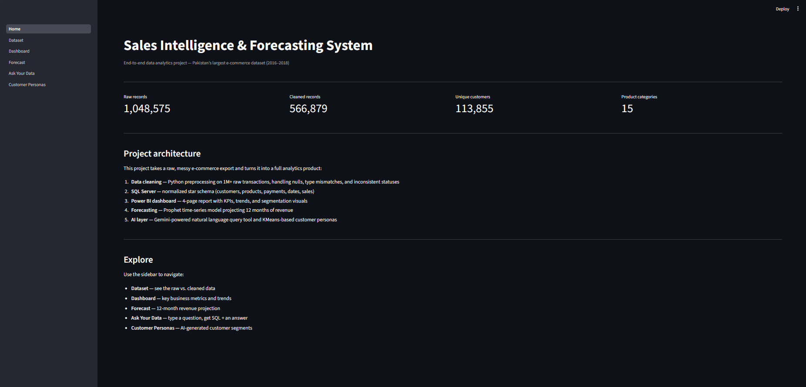
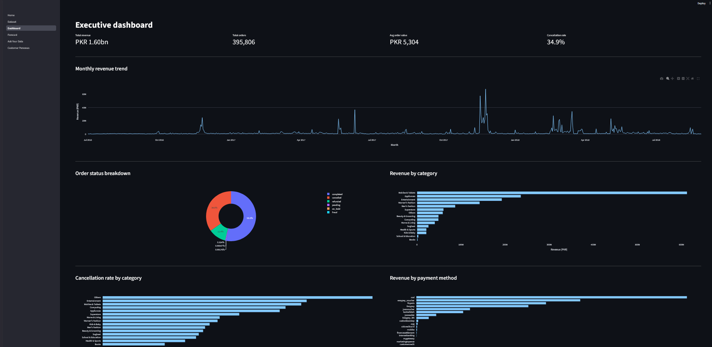
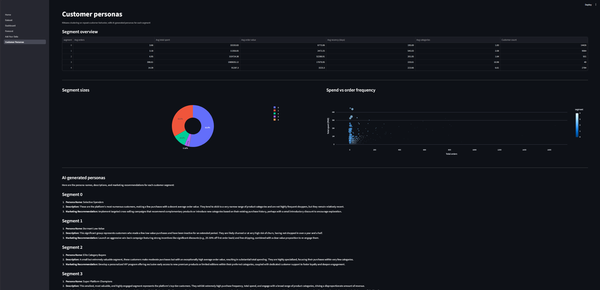

# Sales Intelligence & Forecasting System

An end-to-end data analytics project built on Pakistan's largest e-commerce dataset (2016–2018).
Covers the full analytics stack — data engineering, business intelligence, forecasting, machine learning, and applied AI.


## Live Demo

> Run locally following the setup instructions below.
> Screenshot walkthrough available in `assets/app_screenshots/`.


## Project Overview

This project takes a raw, messy 1M+ row e-commerce export and transforms it into a fully interactive
analytics product with AI-powered natural language querying and customer segmentation.

### Key features

- **Executive dashboard** — revenue trends, order status breakdown, category performance, payment analysis
- **12-month revenue forecast** — Facebook Prophet time-series model with confidence intervals
- **Natural language query tool** — type a question in plain English, Gemini writes and executes the SQL
- **Customer segmentation** — KMeans clustering on repeat-customer behavior with AI-generated personas


## Tech Stack

| Layer | Technology |
|---|---|
| Data cleaning | Python, pandas, numpy |
| Database | Microsoft SQL Server (star schema) |
| BI Dashboard | Power BI Desktop |
| Forecasting | Facebook Prophet |
| Machine Learning | scikit-learn (KMeans) |
| AI Layer | Google Gemini API (gemini-2.5-flash) |
| Web App | Streamlit, Plotly |


## Dataset

**Source:** [Pakistan's Largest E-commerce Dataset — Kaggle](https://www.kaggle.com/datasets/zusmani/pakistans-largest-ecommerce-dataset)

| Metric | Value |
|---|---|
| Raw records | 1,048,575 |
| Cleaned records | 566,879 |
| Date range | July 2016 — August 2018 |
| Unique customers | 113,855 |
| Product categories | 15 |
| Order statuses | 6 (completed, cancelled, refunded, pending, on_hold, fraud) |

---

## Project Architecture
Raw CSV (1M+ rows)

↓

Python — Data Cleaning & Preprocessing

↓

Microsoft SQL Server — Star Schema

(customers, products, payments, dates, sales)

↓

├── Power BI — 4-page Business Dashboard

├── Prophet — 12-month Revenue Forecast

└── Gemini AI Layer

├── Natural Language → SQL Query Tool

└── KMeans Segmentation + AI Customer Personas

↓

Streamlit Web Application
## SQL Schema

Star schema with 5 tables:
customers (customer_id, customer_since)

products  (sku, category)

payments  (payment_id, payment_method)

dates     (date_id, year, month, quarter, day_of_week, month_year, fiscal_year)

sales     (item_id, increment_id, customer_id, sku, payment_method, order_date,

status, status_grouped, price, qty_ordered, grand_total,

discount_amount, discount_pct, revenue_per_unit, is_return, bi_status)

Full schema and analytical queries in `sql/SQL.sql` 


## Key Insights

- **Mobiles & Tablets** is the highest revenue category by a significant margin
- **35% cancellation rate** across all orders — "Others" category has the highest rate
- **COD (Cash on Delivery)** dominates both order volume and revenue — typical for Pakistan's e-commerce market
- A massive **revenue spike in November 2017** (likely Black Friday / end-of-year campaign)
- **49 "Power User" customers** account for a disproportionate share of total platform revenue — likely resellers or business accounts
- Prophet forecast projects continued growth into 2019 with the same seasonal patterns

---

## Customer Segments

| Segment | Name | Count | Description |
|---|---|---|---|
| 0 | Occasional Spenders | 14,426 | Moderate orders, high avg order value, limited categories |
| 1 | Lapsed Low-Value | 9,064 | Inactive 545+ days, lowest spend — likely churned |
| 2 | High-Value Specialists | 931 | Few orders but extremely high avg spend (PKR 52K+) |
| 3 | Super Loyal VIPs | 49 | 398 avg orders, 11 categories — resellers or power users |
| 4 | Regular Engagers | 2,784 | Frequent, multi-category, consistent spenders |

---

## Setup Instructions

### Prerequisites

- Python 3.10+
- Microsoft SQL Server (Express edition works)
- ODBC Driver 17 for SQL Server
- Google Gemini API key ([get one free at aistudio.google.com](https://aistudio.google.com/apikey))
- Power BI Desktop (optional, for viewing the .pbix file)

### 1 — Clone the repo

```bash
git clone https://github.com/MuhammadMustafa23/SalesIntelligenceSystem.git
cd SalesIntelligenceSystem
```

### 2 — Install dependencies

```bash
pip install -r requirements.txt
```

### 3 — Set up SQL Server

Run the schema script in SSMS:

```bash
sql/SQL.sql
```

Then load the cleaned data:

```bash
python pythonscripts/load_to_sql.py
```

### 4 — Configure the AI key

Copy the example file and add your Gemini API key:

```bash
cp app/utils/ai.py
```

Open `app/utils/ai.py` and replace `YOUR_API_KEY_HERE` with your actual key.

### 5 — Run the Streamlit app

```bash
streamlit run app/Home.py
```

Open your browser at `http://localhost:8501`


## Power BI Dashboard

**KPI** =**Key Performace Indicator**

The `.pbix` file in `powerbi/` contains a 4-page interactive report:

- **Executive Overview** — KPI cards, monthly revenue trend, order status donut
- **Product Analysis** — revenue and cancellation rate by category, top products table
- **Customer & Payment Analysis** — payment method breakdown, top customers
- **Forecast** — actual vs predicted revenue with confidence intervals


## Screenshots

### Home


### Dashboard


### Ask Your Data


### Customer Personas

